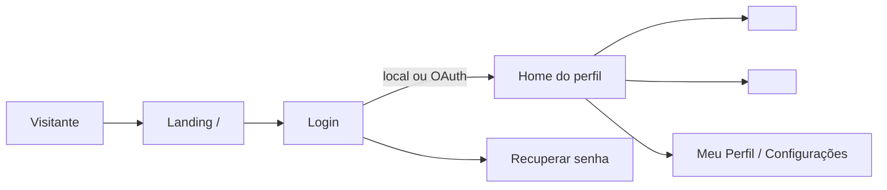

# PROJECT_SPEC.md — Especificação do Projeto/Produto (PRD + TRD mínimo)

**Projeto:** `<nome_do_projeto>`  
**Versão do modelo:** 3.1 (alinhada ao `AGENT_INSTRUCTIONS_DJANGO.md` v3.1)  
**Versão deste documento:** 0.1 (rascunho)  
**Ambiente:** WSL 2 (Ubuntu) em `~/projetos/django/<nome_do_projeto>/`  
**Diretriz superior:** `AGENT_INSTRUCTIONS_DJANGO.md` (Doc ①)  
**Posição no padrão:** Documento ② de 3 — o **mínimo geral** do projeto/produto, ponto de partida para as especificidades do aplicativo.

---

## 0. Como Usar Este Documento

### 0.1. Papel

Este documento reúne:

- o **PRD** (Documento de Requisitos do Produto): visão, perfis, escopo, AppFlow, landing page e briefing de design (§1–§6);
- o **TRD mínimo do projeto** (Documento de Requisitos Técnicos): topologia, dados, autenticação, parâmetros e testes (§7–§11);
- a **governança** do projeto: Definition of Done, decisões (ADR) e changelog (§12–§14).

É um **modelo reutilizável**: copie-o para a raiz do projeto, substitua os `<placeholders>` e preencha as marcas **[PREENCHER]**. O texto em citação (`>`) é orientação e pode ser removido depois de preenchido.

### 0.2. O que NÃO repetir aqui

Tudo o que o Doc ① já define (ambiente, Git, baseline de segurança, mecanismos de RBAC, CSP, rate limit etc.) **não é copiado**. Aqui se registra apenas:

- o **valor** próprio do projeto (**[PREENCHER]**);
- a **exceção** justificada a uma regra do Doc ① (§10);
- o que depende de **produto, público, marca, dados ou negócio**.

Onde estiver **[PADRÃO]**, vale o Doc ① sem alteração.

### 0.3. Mapa de domínios deste documento

| Domínio | Seções | Conteúdo |
| :--- | :--- | :--- |
| **PRODUTO (PRD)** | §1–§6 | Visão e escopo; AppFlow e onboarding; landing e páginas públicas; briefing de design e tema; menus; perfis e matriz RBAC. |
| **PROJETO TÉCNICO (TRD mínimo)** | §7–§11 | Topologia; dados e identificadores; autenticação e integrações; parâmetros e exceções de segurança; testes. |
| **GOVERNANÇA** | §12–§14 | Definition of Done; registro de decisões; changelog. |
| **ANEXOS** | A–C | Casca fina, `base.css` e context processor do tema; `.env.example`; checklist de preenchimento. |

### 0.4. Documentos do projeto

| Arquivo | Conteúdo |
| :--- | :--- |
| `PROJECT_SPEC.md` | Este documento. |
| `regras_de_negocio.md` | **Exclusivo** de regras de negócio (RN) e requisitos funcionais (RF) detalhados. Nenhuma RN é duplicada neste documento. |
| `apps/<app>/README.md` | Documentação individual de cada app (Doc ① §9.3). |
| `ARCHITECTURE.md` · `DATABASE.md` · `API.md` · `TESTING.md` · `SECURITY.md` | Opcionais; só quando o conteúdo não couber aqui. |

---

# PARTE I — DOMÍNIO: PRODUTO (PRD)

---

## 1. Visão e Escopo

### 1.1. Identificação

| Item | Valor |
| :--- | :--- |
| Nome do produto | `<Nome do Produto>` **[PREENCHER]** |
| Descrição em uma frase | **[PREENCHER]** |
| Cliente / patrocinador | **[PREENCHER]** |
| Público final | **[PREENCHER]** |
| Status | Rascunho / Em desenvolvimento / Em produção |

### 1.2. Problema e objetivos

| Objetivo | Indicador de sucesso |
| :--- | :--- |
| **[PREENCHER]** | **[PREENCHER]** |

### 1.3. Perfis de usuário (visão de produto)

| Perfil | Interno/Externo | Objetivo principal | Canal |
| :--- | :-: | :--- | :--- |
| **[PREENCHER]** | | | Web / Mobile |

> Os códigos, a ordem de privilégio e a matriz de permissões ficam na §6.

### 1.4. Escopo

| Dentro do escopo (versão atual) | Fora do escopo |
| :--- | :--- |
| **[PREENCHER]** | **[PREENCHER]** |

Premissas e restrições (legais/LGPD, orçamento, prazo, integrações obrigatórias): **[PREENCHER]**.

### 1.5. Módulos (apps)

| App | Responsabilidade | Reutilizável? | Depende de | README |
| :--- | :--- | :-: | :--- | :-: |
| `core` | Utilitários transversais, criptografia, resolvedor de tenant, handlers de erro. | Sim | — | ☐ |
| `accounts` | Usuário (UUID), perfis, RBAC, login, OAuth, reset de senha. | Sim | `core` | ☐ |
| `audit` | Histórico auditável. | Sim | `core` | ☐ |
| `site` | Landing/apresentação (visibilidade via RBAC), institucional, páginas de erro, tema e configurações do site. | Sim | `core` | ☐ |
| `<dominio>` | **[PREENCHER]** | Não | `core`, `accounts` | ☐ |

### 1.6. Requisitos funcionais

Resumo por módulo, com IDs que apontam para `regras_de_negocio.md`:

| ID | Módulo | Resumo (uma linha) |
| :--- | :--- | :--- |
| RF-001 | **[PREENCHER]** | **[PREENCHER]** |

### 1.7. Requisitos não funcionais do produto

| Tema | Meta |
| :--- | :--- |
| Desempenho | **[PREENCHER]** |
| Disponibilidade | **[PREENCHER]** |
| Acessibilidade | WCAG 2.1 AA (sugerido) |
| Navegadores/dispositivos | **[PREENCHER]** |
| Idioma e fuso | `pt-br`, `America/Sao_Paulo` |
| Retenção de dados | **[PREENCHER]** (ver §8.6) |

### 1.8. Marcos e critérios de aceite

| Marco | Entrega | Critério de aceite |
| :--- | :--- | :--- |
| M1 | **[PREENCHER]** | **[PREENCHER]** |

---

## 2. AppFlow e Onboarding

### 2.1. AppFlow (mapa de navegação por jornada)

> O AppFlow deve ser desenvolvido para **cada produto**. Parta do esqueleto e adicione as jornadas de cada perfil.



| Jornada | Perfil | Entrada | Passos principais | Saída | Rotas |
| :--- | :--- | :--- | :--- | :--- | :--- |
| **[PREENCHER]** | | | | | |

### 2.2. Onboarding de navegação

Apresenta ao usuário, no primeiro acesso, onde estão as funções do seu perfil.

| Perfil | Gatilho | Passos (ex.: tour da NAVBAR, painel inicial, primeira ação) | Saída |
| :--- | :--- | :--- | :--- |
| **[PREENCHER]** | Primeiro login | | Marcado como concluído por usuário |

Requisitos: pode ser pulado e reaberto; acessível por teclado; **não bloqueia** tarefas; o conteúdo respeita o RBAC (só mostra o que o perfil pode usar); JavaScript em arquivo estático (compatível com a CSP, Doc ① §14).

### 2.3. Estados e feedback

Padronizar estados vazio, carregando, erro e sucesso. Mensagens ao usuário via `django.contrib.messages` (ver `MESSAGE_TAGS`, Anexo A).

---

## 3. Landing Page e Páginas Públicas

### 3.1. Papel

Página institucional na rota raiz `/`, **antes do login** (Doc ① §11.1). Apresenta o produto, seus benefícios e características, e conduz ao botão **Login**. Sua exibição é **controlada pelo RBAC** (`site.visibilidade_publica`): com a visibilidade ativa, `/` é a landing; desativada, `/` é a tela de login.

### 3.2. Estrutura

| Seção | Conteúdo | Obrigatória |
| :--- | :--- | :-: |
| Hero | Proposta de valor + botão Login destacado | Sim |
| Apresentação do produto | O que é e para quem | Sim |
| Benefícios | **[PREENCHER]** | Sim |
| Características / Como funciona | **[PREENCHER]** | Sim |
| Credibilidade | Instituição, parceiros, números | Opcional |
| Perguntas frequentes | **[PREENCHER]** | Opcional |
| Chamada final | Botão Login | Sim |
| Rodapé | Contato, institucional, política de privacidade (LGPD) | Sim |

### 3.3. Tom e conteúdo

Tom de voz: **[PREENCHER]** (ex.: sério e acolhedor para serviço público). Texto dos títulos, benefícios e chamadas: **[PREENCHER]**.

### 3.4. Requisitos técnicos

- Acessível sem autenticação e sem dados privados; quando a visibilidade estiver desativada, as páginas controláveis respondem `404`.
- Sem `style=`/`onclick=` inline; CSS/JS estáticos; compatível com a CSP.
- `title`, `meta description` e Open Graph.
- Responsiva e leve; imagens com `alt`.

### 3.5. Visibilidade das páginas públicas

Mecanismo no Doc ① §11.1.

| Item | Valor |
| :--- | :--- |
| Estado inicial da visibilidade | Ativa **[PADRÃO]** / outro: **[PREENCHER]** |
| Páginas públicas controláveis | Landing; apresentação; institucional; perguntas frequentes **[PREENCHER]** |
| Controle | Interruptor geral e, opcionalmente, *flag* por página **[PREENCHER]** |
| Sempre acessíveis (não controláveis) | Login, recuperação de senha, páginas de erro, política de privacidade/termos |
| Autenticado em `/` | Visibilidade ativa: landing com "Ir para o sistema"; desativada: home do perfil **[PADRÃO]** |
| Páginas ocultas respondem | `404` **[PADRÃO]** |
| Escopo da configuração | Global / por tenant (§8.8) **[PREENCHER]** |
| Quem altera | Perfis com `site.visibilidade_publica` (§6.3) |

---

## 4. Briefing de Design (UI/UX)

### 4.1. Identidade

| Item | Valor |
| :--- | :--- |
| Nome e logotipo | **[PREENCHER]** |
| Personalidade da marca | **[PREENCHER]** |
| Referências visuais | **[PREENCHER]** |

### 4.2. Tema do produto

> O **mecanismo** (dez modelos, três cores, seletor de cores, paletas, eixos de estilo e variantes de layout) está no Doc ① §11.5 a §11.12. Aqui o produto escolhe o que usa.

| Item | Valor |
| :--- | :--- |
| Modelos habilitados | T01 Alegre · T02 Sofisticado · T03 Sóbrio · T04 Animado · T05 Profissional · T06 Luxuoso · T07 SoftClean · T08 Noturno · T09 Acessível · T10 Outro. Marcar os habilitados: **[PREENCHER]** |
| Modelo padrão | T05 Profissional **[PADRÃO]** / outro: **[PREENCHER]** |
| Paleta padrão (Fundos · Destaques · Escritas) | A do modelo padrão, ou a da marca: `#______` · `#______` · `#______` **[PREENCHER]** |
| Cor de marca obrigatória? | Sim/não; se sim, qual vai em **Destaques** **[PREENCHER]** |
| T10 Outro (seletor de cores e 20 paletas) | Habilitado? Todas as paletas ou um subconjunto? **[PREENCHER]** |
| Eixos de estilo padrão | Raio · sombra · densidade · movimento · tipografia · ícones: herdados do modelo, salvo marca **[PREENCHER]** |
| Quem altera o tema | `site.tema_editar`: padrão 3 e 4; delegar também a: **[PREENCHER]** |
| Escopo da configuração | Global / por tenant (§8.8) **[PREENCHER]** |
| Restaurar padrão | Volta ao modelo e à paleta padrão definidos acima |

Contraste mínimo, regras de derivação e validação: Doc ① §11.7. Os tokens ficam em `/tema.css` e o fallback em `static/css/base.css` (Anexo A).

### 4.3. Tipografia

Por padrão, a pilha de fontes **do sistema** definida pelo modelo (Doc ① §11.10). Fonte de marca externa (ex.: Google Fonts) é **exceção**: o host entra na CSP e é registrado na §10.2.

| Item | Valor |
| :--- | :--- |
| Fonte de marca | Não / **[PREENCHER]** |
| Escala | h1…h6, corpo, `small` **[PREENCHER]** |

### 4.4. Componentes e semântica

| Componente | Classe / Padrão | Utilização obrigatória |
| :--- | :--- | :--- |
| Botão de confirmação | `btn btn-success` | Salvar, gravar, submeter. |
| Botão de cancelamento | `btn btn-danger` | Cancelar edição, excluir. |
| Botão neutro / retorno | `btn btn-outline-secondary` | Voltar, limpar filtros. |
| Botão de ação / novo | `btn btn-primary` | Novo cadastro, exportar, ações de toolbar. |
| Entradas | `.form-control`, `.form-select` | Campos de formulário. |
| Container de telas | `card` + `card-body` | Formulários e tabelas. |
| Status | `badge` com cor semântica | Estados de fluxo. |
| Excluir/alterar estado | Formulário POST com `` | Nunca link GET. |

As cores de cada classe de botão vêm dos tokens do tema (Doc ① §11.7). Páginas de domínio **não** usam cor fixa nem estilo próprio.

### 4.5. Layout e informação progressiva

Casca: **navbar + toolbar + conteúdo + rodapé** (herdada de `base.html`).

Padrão opcional de informação progressiva em níveis, para listagens ricas:

1. Lista principal limpa e objetiva.
2. Seta de expansão in-line para conferência rápida, sem perder a posição de rolagem.
3. Botão "Detalhes" abrindo **Offcanvas** lateral (35% a 45% da tela) com abas e menu contextual "Mais Ações".
4. Opção "Ver completo", abrindo a página dedicada com o dossiê integral.

Adotado neste projeto? **[PREENCHER: sim/não]**

**Layout padrão por tipo de página.** Variantes e descrições: Doc ① §11.11. O padrão sai do modelo escolhido na §4.2; preencha apenas se o produto fixar outra variante.

| Tipo de página | Variante padrão do produto | Observações |
| :--- | :--- | :--- |
| Casca autenticada | `topo` / `lateral` / `lateral-recolhivel` **[PREENCHER]** | |
| Landing/apresentação | **[PREENCHER]** | |
| Login | **[PREENCHER]** | A ordem do formulário é fixa (Doc ① §16.2). |
| Lista/relatório | **[PREENCHER]** | Visão adicional (ex.: kanban, alternável com a tabela): **[PREENCHER]** |
| Formulário | **[PREENCHER]** | |
| Detalhe/dossiê | **[PREENCHER]** | |
| Painel | **[PREENCHER]** | |
| Erro / estado vazio | **[PREENCHER]** | |

### 4.6. Telas-chave

| Tela | Perfil | Rota (`name`) | Componentes principais | Observações |
| :--- | :--- | :--- | :--- | :--- |
| Login | Visitante | `accounts:login` | Formulário na ordem do Doc ① §16.2: Usuário/e-mail → Senha → (Lembrar-me) → **Entrar** → *Esqueci minha senha* → "ou" e login social → cadastro | Link "Esqueci minha senha" **abaixo** do botão Entrar |
| **[PREENCHER]** | | | | |

### 4.7. Acessibilidade e responsividade

Mobile-first; foco visível; rótulos em todos os campos; navegação por teclado; alvos de toque adequados; sem informação transmitida só por cor.

### 4.8. Páginas de erro

Tom e conteúdo das páginas exigidas pelo Doc ① §20. A 404 é personalizada e pode ter variante pública e autenticada.

| Página | Mensagem | Ação sugerida | Variantes |
| :--- | :--- | :--- | :--- |
| 404 | **[PREENCHER]** | Busca/atalhos permitidos ao perfil, voltar ao início | Pública / Autenticada |
| 403 | **[PREENCHER]** | Voltar; solicitar acesso | — |
| 400 / CSRF | **[PREENCHER]** | Recarregar a página | — |
| 500 | **[PREENCHER]** (autossuficiente) | Tentar novamente mais tarde | — |

### 4.9. Implementação base

Casca fina `templates/base.html`, variantes em `templates/layouts/`, componentes em `templates/componentes/`, `static/css/base.css` e a rota `/tema.css`: **Anexo A**.

---

## 5. Navegação e Menus (NAVBAR)

Regras do Doc ① §11.2: toda função de usuário tem item de menu **na aplicação** (o Django Admin é só backoffice); menus agrupados por assunto e funções correlatas; visibilidade vinda do RBAC.

**NAVBAR pública:** marca + botão **Login** destacado no canto superior direito.  
**NAVBAR autenticada:** menus por grupo + nome/avatar + notificações com badge + dropdown (`Meu Perfil`, `Configurações`, `Sair` via POST).

| Grupo de menu | Item | Rota (`name`) | Funcionalidade RBAC | Perfis |
| :--- | :--- | :--- | :--- | :--- |
| **[PREENCHER]** | | | `modulo.acao` | |
| Administração | Matriz RBAC | `accounts:matriz` | `accounts.matriz` | 3, 4 |
| Administração | Aparência (tema) | `site:tema` | `site.tema_editar` | 3, 4 (delegável) |
| Administração | Visibilidade pública | `site:visibilidade` | `site.visibilidade_publica` | 3, 4 (delegável) |

---

## 6. Perfis, Autorização e Matriz RBAC do Projeto

### 6.1. Perfis

Mecanismo no Doc ① §17.4. O número identifica o **grupo**; a **ordem de privilégio** é declarada na coluna própria (1 = maior).

| Grupo | Nome | Ordem de privilégio | Escopo de dados | Observações |
| :-: | :--- | :-: | :--- | :--- |
| 0 | `<Perfil operacional 0>` **[PREENCHER]** | | | |
| 1 | `<Perfil operacional 1>` **[PREENCHER]** | | | |
| 2 | `<Perfil operacional 2>` **[PREENCHER]** | | | |
| 3 | Administrador (reservado) | | | |
| 4 | Desenvolvedor (reservado) | | | |

**Escopo da atribuição e superadministrador** (relevante se o modo de tenancy não for `single`, §8.8): padrão = superadministrador é o grupo 4 com escopo global; o Administrador atua só no seu tenant. Decisão do produto: **[PREENCHER]**.

### 6.2. Usuários externos

Usuários fora da escala interna (cidadão, cliente, paciente etc.): **[PREENCHER: existem? como são modelados?]**. Padrão: perfil externo/portal, com escopo restrito aos **próprios** dados, página individual para consulta e nenhuma visibilidade da matriz.

### 6.3. Matriz de funcionalidades

Fonte única de verdade (dado). Padrão: negar. Linhas universais já preenchidas pelo Doc ① (§17.5). Nas funcionalidades **delegáveis**, marque ✔ também para outros grupos quando o produto decidir.

| Funcionalidade | 0 | 1 | 2 | 3 | 4 |
| :--- | :-: | :-: | :-: | :-: | :-: |
| Ver/editar a matriz RBAC (`accounts.matriz`, **não delegável**) | ✖ | ✖ | ✖ | ✔ | ✔ |
| Atribuir perfis (`accounts.atribuir_perfis`) | ✖ | ✖ | ✖ | ✔ (até 3) | ✔ (até 4) |
| Alterar o tema (`site.tema_editar`, delegável) | ✖ | ✖ | ✖ | ✔ | ✔ |
| Ativar/desativar páginas públicas (`site.visibilidade_publica`, delegável) | ✖ | ✖ | ✖ | ✔ | ✔ |
| **[PREENCHER]** `modulo.acao` | | | | | |

### 6.4. Elevação e segregação de funções

Regras de elevação e de edição da matriz: **[PADRÃO]** (Doc ① §17.4).

Segregação específica do produto (o que cada perfil operacional **não** pode acessar): **[PREENCHER]**.

### 6.5. Política de respostas por classe de recurso

| Recurso | Identificador | Resposta ao não autorizado | Justificativa |
| :--- | :--- | :-: | :--- |
| **[PREENCHER]** (ex.: registro privado de outro usuário) | UUID | `404` | Evita enumeração. |
| **[PREENCHER]** (ex.: tela de configuração global) | — | `403` | Existência conhecida. |

### 6.6. Revisão IDOR / BOLA

| Recurso / endpoint | Escopo permitido | Queryset escopado? | Teste |
| :--- | :--- | :-: | :-: |
| **[PREENCHER]** | | ☐ | ☐ |

---

# PARTE II — DOMÍNIO: PROJETO TÉCNICO (TRD MÍNIMO)

---

## 7. Topologia e Estrutura de Arquivos

Arquitetura **modular** (Doc ① §9): `apps/` com apps desacopladas; templates globais com **casca fina e variantes**, e estáticos na raiz. Os Documentos ① e ③ ficam na pasta do ecossistema (`~/projetos/django/`), acima da raiz de cada projeto (Doc ① §0.4).

```text
~/projetos/django/<nome_do_projeto>/
├── .venv/                   # Ambiente virtual (ignorado no Git)
├── .env                     # Credenciais locais (ignorado no Git)
├── .env.example             # Nomes das variáveis, sem valores
├── .gitignore               # .venv/, .env, *.pyc, __pycache__/, *.log, .DS_Store, media/, staticfiles/ (+ db.sqlite3 se SQLite local; Doc ① §4.7)
├── requirements.txt         # Dependências registradas
├── manage.py
├── PROJECT_SPEC.md          # Este documento
├── regras_de_negocio.md     # RF/RN
│
├── templates/
│   ├── base.html            # Casca fina:  (Anexo A)
│   ├── layouts/             # Variantes de layout (Doc ① §11.11)
│   │   ├── _assets.html     # Links de CSS: Bootstrap, base.css, /tema.css
│   │   ├── shell/           # topo · lateral · lateral_recolhivel
│   │   ├── landing/         # hero_centralizado · hero_dividido · faixas
│   │   ├── login/           # cartao · dividido · coluna
│   │   └── lista/ · formulario/ · detalhe/ · painel/ · erro/
│   ├── componentes/         # Lista, formulário, detalhe, cartão, painel (uma implementação por variante)
│   ├── partials/            # _navbar_menus.html, _messages.html
│   └── 400.html · 403.html · 404.html · 500.html
│
├── static/
│   ├── css/base.css         # Estrutura; consome tokens (fallback = tema Profissional)
│   └── js/                  # app.js, onboarding.js, seletor-cor.js, tema-preview.js (sem JS inline)
│
├── <pacote_de_config>/      # Módulo gerado pelo startproject
│   ├── settings.py          # django-environ; baseline do Doc ① §12
│   ├── urls.py              # Rotas centrais, handlers de erro
│   ├── asgi.py
│   └── wsgi.py
│
└── apps/
    ├── __init__.py
    ├── core/                # Cripto, UUIDModel, resolvedor de tenant, handlers, helpers de rate limit
    ├── accounts/            # Usuário (UUID), RBAC, login, OAuth, reset
    ├── audit/               # Histórico auditável
    ├── site/                # Landing, institucional, tema (ConfigTema), visibilidade pública, /tema.css
    └── <dominio>/           # App(s) do produto
        ├── migrations/
        ├── admin.py · apps.py · forms.py · models.py · services.py
        ├── urls.py · views.py · tests.py (ou tests/)
        ├── templates/<dominio>/
        ├── static/<dominio>/
        └── README.md        # Obrigatório (Doc ① §9.3)
```

Configuração mínima em `settings.py`: `TEMPLATES[0]['DIRS'] = [BASE_DIR / 'templates']`, `STATICFILES_DIRS = [BASE_DIR / 'static']`, apps registradas como `apps.<nome>` e o context processor do tema (Anexo A.5). Também: `AUTH_USER_MODEL = 'accounts.User'` definido **antes da primeira migração** (§8.3) e `PASSWORD_HASHERS` com Argon2id em primeiro lugar (Doc ① §16.1).

---

## 8. Dados, Identificadores e Persistência

### 8.1. SGBD

- **Local:** SQLite (`db.sqlite3`) na raiz, no filesystem nativo do WSL (ext4), protegido pelo `.gitignore`.
- **Produção:** **[PREENCHER]**.
- Esquema só por migrações (`makemigrations` / `migrate`). Nunca editar o banco manualmente.

### 8.2. Identificadores UUIDv4

Mecanismo no Doc ① §10.4. Entidades que expõem identificador (todas, por padrão):

| Entidade | Exposta em | UUID como PK? |
| :--- | :--- | :-: |
| Usuário | URLs, APIs | Sim |
| **[PREENCHER]** | | Sim |

### 8.3. Usuário customizado

Modelo de usuário customizado, com PK UUID, criado **antes da primeira migração** (Doc ① §10.4 e §23.4), com `AUTH_USER_MODEL` apontando para ele (padrão sugerido: `accounts.User`): ☐ feito. A ordem de bootstrap está no `DEV_ENVIRONMENT_GUIDELINES.txt` (PARTE 4 e PARTE 6, Fluxo 2).

### 8.4. Transações e invariantes críticas

| Invariante | Onde é garantida | Teste |
| :--- | :--- | :-: |
| **[PREENCHER]** | `services.py` em `transaction.atomic()` + constraint | ☐ |

### 8.5. Máquinas de estado

| Entidade | Estados e transições permitidas | Exige justificativa em |
| :--- | :--- | :--- |
| **[PREENCHER]** | `A → B → C`; `B → D` | Transições `B → D` |

### 8.6. Classificação de dados (LGPD)

| Dado / campo | Classe (comum / pessoal / sensível) | Cifrado (Fernet)? | Retenção | Acesso (perfis) |
| :--- | :--- | :-: | :--- | :--- |
| **[PREENCHER]** | | | | |

### 8.7. Arquivos enviados

| Item | Valor |
| :--- | :--- |
| Tipos permitidos (allowlist) | **[PREENCHER]** |
| Tamanho máximo por arquivo | **[PREENCHER]** |
| Armazenamento | Fora de diretório público; nome UUID |
| Entrega de documento sensível | Endpoint autenticado com streaming **ou** URL pré-assinada com expiração (Doc ① §15.6) |

### 8.8. Tenancy (declaração do produto)

Mecanismo e contrato: Doc ① §10.6. **Sem declaração, o projeto é `single`.**

| Item | Valor |
| :--- | :--- |
| Modo (`TENANCY_MODE`) | `single` **[PADRÃO]** · `row` · `schema` · `database` |
| ADR da decisão | Obrigatório se o modo não for `single`: ADR-___ (§13) |
| Resolução do tenant | Subdomínio / prefixo de caminho / vínculo do usuário **[PREENCHER]** |
| Dados globais compartilhados (sem escopo) | **[PREENCHER]** |
| Configurações por tenant | Tema · visibilidade pública · credenciais OAuth (cifradas no banco) · parâmetros: **[PREENCHER]** |
| Superadministrador entre tenants | Grupo 4 com escopo global **[PADRÃO]** / outro: **[PREENCHER]** |
| Matriz RBAC | Global **[PADRÃO]** / com sobreposição por tenant: **[PREENCHER]** |
| Migração `single` → `row` prevista? | **[PREENCHER]** |

| Entidade | Escopo (global / tenant) | Unicidade por escopo? |
| :--- | :--- | :-: |
| **[PREENCHER]** | | ☐ |

---

## 9. Autenticação, Integrações e Segredos do Projeto

### 9.1. Login

- **Login local (usuário e senha): [PADRÃO]**, obrigatório.
- Provedores OAuth 2.0/2.1 (`django-allauth`):

| Provedor | Habilitado | Escopos | Armazena tokens? | Variáveis `.env` |
| :--- | :-: | :--- | :-: | :--- |
| Google | ☐ | | ☐ | `GOOGLE_CLIENT_ID`, `GOOGLE_CLIENT_SECRET` |
| Microsoft | ☐ | | ☐ | **[PREENCHER]** |
| Apple | ☐ | | ☐ | **[PREENCHER]** |

Se armazenar tokens: **Fernet em repouso** (Doc ① §16.4). Com tenancy diferente de `single`, as credenciais do provedor por tenant ficam cifradas (Fernet) no banco (Doc ① §10.6; §8.8). Página "Wizard" de configuração das chaves: **[PREENCHER: sim/não]**.

### 9.2. Senha e recuperação

| Item | Valor |
| :--- | :--- |
| `PASSWORD_RESET_TIMEOUT` | **[PREENCHER]** (padrão sugerido: 3600 s) |
| Política de senha (validadores) | **[PREENCHER]** |
| Remetente de e-mail | **[PREENCHER]** |

### 9.3. Sessão e MFA

| Item | Valor |
| :--- | :--- |
| `SESSION_COOKIE_AGE` | **[PREENCHER]** |
| Expiração por inatividade | **[PREENCHER]** |
| MFA obrigatória para perfis | **[PREENCHER]** (recomendado: 3 e 4) |

### 9.4. Integrações e webhooks

| Integração | Direção | Autenticação | Segredo (`.env`) | Assinatura `X-Signature` |
| :--- | :--- | :--- | :--- | :-: |
| **[PREENCHER]** | Entrada/Saída | | `WEBHOOK_SECRET_<NOME>` | ☐ |

### 9.5. Variáveis de ambiente específicas

Além do conjunto-base do Doc ① §18.4, listar aqui (sem valores) e no `.env.example`: **[PREENCHER]**.

---

## 10. Parâmetros de Segurança e Exceções ao Doc ①

### 10.1. Parâmetros do projeto

Preencha apenas o que **diferir** do baseline; o restante é **[PADRÃO]**.

| Parâmetro | Baseline (Doc ①) | Valor do projeto |
| :--- | :--- | :--- |
| Hosts adicionais na CSP | Somente a CDN em allowlist | **[PREENCHER]** |
| `frame-ancestors` / `X_FRAME_OPTIONS` | `'none'` / `DENY` | **[PADRÃO]** |
| HSTS (`SECURE_HSTS_SECONDS`) | 3600, elevando até 31536000 | **[PREENCHER]** |
| Proxy reverso e cabeçalho de IP real | Nenhum (não confiar) | **[PREENCHER]** |
| Cache do rate limit | Redis/Memcached em produção | **[PREENCHER]** |
| Rate limit: login | 5/min por IP; 5 falhas → 15 min | **[PADRÃO]** |
| Rate limit: recuperação de senha | 3/hora | **[PADRÃO]** |
| Rate limit: download sensível | 30/min por usuário | **[PADRÃO]** |
| Rate limit: API | 60/min por usuário | **[PADRÃO]** |
| Rate limit: cadastro / convite | 5/hora por IP | **[PADRÃO]** |
| Rate limit: callback OAuth | 20/min por IP | **[PADRÃO]** |
| Rate limit: webhook | 60/min por origem | **[PADRÃO]** |
| Rate limit: páginas públicas e API anônima | 20/min por IP | **[PADRÃO]** |
| Limites de entrada (`DATA_UPLOAD_MAX_MEMORY_SIZE` / `DATA_UPLOAD_MAX_NUMBER_FIELDS`) | 1 MiB / 500 | **[PADRÃO]** |
| Expiração do token de acesso JWT (se houver JWT) | ≤ 15 min (sugestão, Doc ① §18.2) | **[PREENCHER]** |
| Expiração de URL pré-assinada de documento sensível | 5 min (sugestão, Doc ① §15.6) | **[PADRÃO]** |
| `ADMIN_URL` | Não padrão | **[PREENCHER]** |
| Tamanho máximo de upload | Definir por projeto | **[PREENCHER]** (ver §8.7) |
| Modo de tenancy (`TENANCY_MODE`) | `single` | **[PREENCHER]** (ver §8.8) |
| Cache de `/tema.css` | URL versionada, cache longo | **[PADRÃO]** |
| Ordem do formulário de login | Doc ① §16.2 | **[PADRÃO]** |

### 10.2. Registro de exceções

Qualquer desvio de uma regra do Doc ① (ex.: `frame-ancestors 'self'` para pré-visualizar documento em iframe; cookie legível por JavaScript) **precisa** de uma linha aqui. Exceção sem justificativa **não é aprovada**.

| ID | Regra do Doc ① relaxada | Motivo | Risco e mitigação | Responsável | Data | Revisão |
| :--- | :--- | :--- | :--- | :--- | :--- | :--- |
| EXC-001 | | | | | | |

---

## 11. Estratégia de Testes

- **Localização:** `apps/<app>/tests.py` (ou pacote `tests/`), executáveis por app (`python manage.py test apps.<app>`, Doc ① §9.2).
- **Escopo mínimo obrigatório:**
  - integridade de modelos e métodos de cálculo;
  - regras de negócio críticas e serviços em `services.py`;
  - **isolamento de acesso (ownership/BOLA):** usuário A não manipula recurso de B;
  - rotas, códigos HTTP e permissões de views;
  - **testes de segurança do Doc ① §22.1** (os 19 testes mínimos): ownership/BOLA, view protegida sem autenticação, RBAC, matriz, 404 sem rotas, cabeçalhos, cookies, GET sem efeito, rate limit, limites de entrada, webhook, `check --deploy`, tema (contraste, `/tema.css`, valores validados), ausência de estilo inline, ordem do formulário de login, visibilidade pública, tenancy e funcionalidades reservadas.
- **Específicos do produto:**

| Regra crítica | Teste |
| :--- | :--- |
| **[PREENCHER]** | ☐ |

---

# PARTE III — GOVERNANÇA

---

## 12. Definition of Done (DoD)

Para considerar qualquer funcionalidade finalizada antes de abrir Pull Request (complementa o Doc ① §23.5):

- [ ] Lógica de negócio conforme `regras_de_negocio.md`; regras em `forms.py`/`services.py`, views enxutas.
- [ ] Identificadores UUIDv4; objeto buscado por queryset escopado; resposta `401`/`403`/`404` conforme §6.5.
- [ ] Funcionalidade registrada na matriz RBAC (§6.3) e no menu da NAVBAR (§5).
- [ ] Interface herda de `templates/base.html` e preenche apenas blocos e componentes do tema (sem estilo, cor fixa nem estrutura de casca), respeita o padrão de botões (§4.4) e **não usa JS/CSS inline** (CSP).
- [ ] Formulário de login, se criado ou alterado, segue a ordem do Doc ① §16.2.
- [ ] Entrada validada (formulário, DTO, banco) e limites de tamanho definidos; dados sensíveis cifrados (§8.6).
- [ ] Ação que altera estado usa POST + CSRF; endpoints sensíveis com rate limit (§10.1); acessos relevantes auditados e sem segredos em logs (Doc ① §21).
- [ ] Testes automatizados cobrindo cenários válidos, inválidos e controle de acesso.
- [ ] Migrações geradas e aplicadas sem conflitos.
- [ ] Novas variáveis documentadas no `.env.example`.
- [ ] `README.md` da app atualizado.
- [ ] Se o modo de tenancy não for `single`: modelos com escopo declarados (§8.8), unicidade por escopo e teste de isolamento entre tenants.
- [ ] Exceções ao Doc ① registradas na §10.2.
- [ ] `python manage.py check --deploy` sem avisos injustificados.
- [ ] Conventional Commits e salvaguardas do Doc ① observados.

---

## 13. Registro de Decisões Arquiteturais (ADR)

| ID | Decisão | Contexto | Alternativas | Status | Data |
| :--- | :--- | :--- | :--- | :--- | :--- |
| ADR-001 | **[PREENCHER]** | | | Proposta/Aceita | |

ADR é **obrigatório** para: modo de tenancy diferente de `single` (§8.8); PK inteira com `public_id`; índice cego para campo cifrado; qualquer exceção estrutural ao Doc ①.

---

## 14. Registro de Alterações

### Modelo v3.1

- **Alinhamento de versão:** o modelo passa a acompanhar a numeração do `AGENT_INSTRUCTIONS_DJANGO.md` (Doc ①). A estrutura já refletia as integrações da v3.1 do Doc ① (temas, login, visibilidade pública, tenancy, renumeração dos documentos); esta versão conferiu e alinhou o restante.
- **§7:** comentário do `.gitignore` alinhado ao Doc ① §4.7; `AUTH_USER_MODEL` e Argon2id na configuração mínima; indicação dos Documentos ① e ③ na pasta do ecossistema.
- **§8.3:** referência à ordem de bootstrap (usuário com UUID antes da primeira migração).
- **§10.1:** escopos mínimos de rate limit completos (cadastro/convite, callback OAuth, webhook, páginas públicas e API anônima), limites de entrada, expiração de JWT e de URL pré-assinada.
- **§11:** lista dos 19 testes mínimos do Doc ① §22.1 e comando de execução por app.
- **§12:** DoD com POST + CSRF, rate limit e auditoria (Doc ① §23.5).
- **Anexo A.3:** nomes de rota do login/logout com namespace (`accounts:login`, `accounts:logout`), coerentes com a §4.6 e o Doc ① §9.2.
- **Anexo B:** variáveis opcionais de sobrescrita do baseline (comentadas).
- **Anexo C:** itens de conferência de versão, `.gitignore` e `AUTH_USER_MODEL`.

### Modelo v2.1

- **Renumeração dos documentos:** este passa a ser o **Documento ②** (especificação do projeto); o `DEV_ENVIRONMENT_GUIDELINES.txt` passa a ser o Documento ③. Referências atualizadas.
- **Temas de design:** a §4.2 deixa de ser uma tabela fixa de cores e passa a registrar o **tema do produto** (modelos habilitados, padrão, paleta, quem altera, escopo). Nova tabela de **layout padrão por tipo de página** (§4.5).
- **Visibilidade das páginas públicas** (§3.5), controlada pelo RBAC; `/` é landing ou login conforme o estado.
- **Login:** ordem do formulário registrada em §4.6 e no DoD.
- **Tenancy:** nova §8.8 (declaração do produto), parâmetro `TENANCY_MODE` e itens de DoD/ADR.
- **RBAC:** novas funcionalidades `site.tema_editar` e `site.visibilidade_publica`, escopo e superadministrador (§6).
- **Topologia (§7) e Anexo A:** `base.html` passa a ser **casca fina** (``), com variantes em `templates/layouts/`, componentes em `templates/componentes/`, `static/css/base.css` e rota `/tema.css` (substitui `theme.css`).

### Modelo v2.0

- Reestruturado por domínios: **Produto (PRD)**, **Projeto Técnico (TRD mínimo)** e **Governança**.
- Incluídos PRD, **AppFlow e onboarding**, **landing page**, **briefing de design** (paleta, tipografia, componentes, telas), menus da NAVBAR e **perfis/matriz RBAC** como seções do projeto.
- Arquitetura alterada de **app único** para **apps modulares** em `apps/`, com README por app.
- Incluídas as seções de dados (UUIDv4, classificação LGPD, arquivos), autenticação/integrações e **parâmetros e exceções de segurança** (§10).
- `base.html` reescrito para ser **compatível com CSP** (sem CSS inline), com Bootstrap/Icons fixados e SRI; tokens movidos para `static/css/theme.css`.
- Correções do modelo anterior: tokens `--bs-primary` não recoloriam `.btn-primary` no Bootstrap 5.3 (agora mapeados em `theme.css`); `message.tags` `error` não corresponde à classe `danger` (agora via `MESSAGE_TAGS`); removida a classe inexistente `fs-7`.
- Corrigida a referência inconsistente a `regras_de_negocio_e_outras_definicoes.md`: o arquivo oficial é **`regras_de_negocio.md`**.

### Modelo v1.0

- Versão inicial: app único, `base.html` com estilos inline, estratégia de testes e DoD.

---

# ANEXOS

---

## Anexo A — Casca fina, `base.css` e ajustes de settings

Implementação de referência do Doc ① §11.5. **Só a variante de casca `topo` é codificada aqui**; as demais variantes (`lateral`, `lateral_recolhivel`, landing, login, lista, formulário, detalhe, painel, erro) são descritas no Doc ① §11.11 e implementam o **mesmo contrato de blocos**.

### A.1. `templates/base.html` (casca fina)

```html

```

`shell_template` é fornecido pelo context processor do tema (A.5), por exemplo `layouts/shell/topo.html`. Páginas de domínio continuam estendendo `base.html` e preenchendo apenas os blocos `title`, `meta`, `extra_head`, `page_title`, `page_subtitle`, `toolbar_actions`, `navbar_notifications`, `content` e `extra_js`.

### A.2. `templates/layouts/_assets.html`

```html

<!-- Bootstrap 5.3.3 e Icons 1.11.3: versão fixa. Preencher integrity (SRI) com o hash oficial de cada arquivo. -->
<link href="https://cdn.jsdelivr.net/npm/bootstrap@5.3.3/dist/css/bootstrap.min.css"
      rel="stylesheet" crossorigin="anonymous" integrity="<SRI_BOOTSTRAP_CSS>">
<link href="https://cdn.jsdelivr.net/npm/bootstrap-icons@1.11.3/font/bootstrap-icons.min.css"
      rel="stylesheet" crossorigin="anonymous" integrity="<SRI_ICONS_CSS>">
<link href="" rel="stylesheet">
<link href="?v={{ tema_versao }}" rel="stylesheet">
```

> A página `500.html` **não** usa este arquivo: carrega só Bootstrap e `base.css`, sem `/tema.css` e sem context processors (Doc ① §11.12, item 7).

### A.3. `templates/layouts/shell/topo.html` (variante `topo`)

```html

<!DOCTYPE html>
<html lang="pt-br" data-bs-theme="{{ tema.bs_theme }}" data-tema="{{ tema.slug }}"
      data-raio="{{ tema.raio }}" data-sombra="{{ tema.sombra }}" data-densidade="{{ tema.densidade }}"
      data-movimento="{{ tema.movimento }}" data-tipografia="{{ tema.tipografia }}" data-icones="{{ tema.icones }}">
<head>
    <meta charset="UTF-8">
    <meta name="viewport" content="width=device-width, initial-scale=1.0">
    <title><Nome do Produto></title>
    
    
    
</head>
<body>
    <a class="visually-hidden-focusable" href="#conteudo">Ir para o conteúdo</a>

    <!-- NAVBAR -->
    <nav class="navbar navbar-expand-lg app-navbar sticky-top shadow-sm" data-bs-theme="{{ tema.navbar_bs }}">
        <div class="container-fluid px-4">
            <a class="navbar-brand d-flex align-items-center gap-2 fw-bold" href="/">
                <i class="bi bi-layers-fill"></i> <Nome do Produto>
            </a>
            <button class="navbar-toggler" type="button" data-bs-toggle="collapse"
                    data-bs-target="#navMenu" aria-controls="navMenu" aria-expanded="false" aria-label="Alternar menu">
                <span class="navbar-toggler-icon"></span>
            </button>

            <div class="collapse navbar-collapse" id="navMenu">
                <ul class="navbar-nav me-auto mb-2 mb-lg-0">
                    
                        {# menu_grupos vem de um context processor alimentado pelo RBAC (Doc ① §11.2) #}
                        
                        <li class="nav-item dropdown">
                            <a class="nav-link dropdown-toggle" href="#" role="button"
                               data-bs-toggle="dropdown" aria-expanded="false">
                                <i class="bi {{ grupo.icone }}"></i> {{ grupo.titulo }}
                            </a>
                            <ul class="dropdown-menu">
                                
                                <li><a class="dropdown-item" href="{{ item.url }}">{{ item.titulo }}</a></li>
                                
                            </ul>
                        </li>
                        
                    
                </ul>

                <ul class="navbar-nav ms-auto align-items-center">
                    
                        
                        <li class="nav-item dropdown">
                            <a class="nav-link dropdown-toggle d-flex align-items-center gap-2"
                               href="#" role="button" data-bs-toggle="dropdown" aria-expanded="false">
                                <i class="bi bi-person-circle fs-5"></i> {{ user.get_full_name|default:user.get_username }}
                            </a>
                            <ul class="dropdown-menu dropdown-menu-end shadow">
                                <li><a class="dropdown-item" href="#"><i class="bi bi-person me-2"></i>Meu Perfil</a></li>
                                <li><a class="dropdown-item" href="#"><i class="bi bi-gear me-2"></i>Configurações</a></li>
                                <li><hr class="dropdown-divider"></li>
                                <li>
                                    <form method="post" action="" class="d-inline">
                                        
                                        <button type="submit" class="dropdown-item text-danger">
                                            <i class="bi bi-box-arrow-right me-2"></i>Sair
                                        </button>
                                    </form>
                                </li>
                            </ul>
                        </li>
                    
                        <li class="nav-item">
                            <a class="btn btn-sm btn-login fw-semibold" href="">
                                <i class="bi bi-box-arrow-in-right"></i> Login
                            </a>
                        </li>
                    
                </ul>
            </div>
        </div>
    </nav>

    <!-- TOOLBAR -->
    <header class="app-toolbar">
        <div class="container-fluid px-4 d-flex justify-content-between align-items-center">
            <div>
                <h1 class="h4 mb-0 fw-bold">Visão Geral</h1>
                <small class="text-muted"></small>
            </div>
            <div class="d-flex gap-2"></div>
        </div>
    </header>

    <!-- MENSAGENS -->
    <div class="container-fluid px-4">
        
            <div class="alert alert-{{ message.tags|default:'info' }} alert-dismissible fade show" role="alert">
                {{ message }}
                <button type="button" class="btn-close" data-bs-dismiss="alert" aria-label="Fechar"></button>
            </div>
        
    </div>

    <!-- CONTEÚDO -->
    <main id="conteudo" class="container-fluid px-4 mb-5">
        
    </main>

    <footer class="py-3 text-center text-muted small">
        <div class="container-fluid">&copy; 2026 <Nome do Produto> — Todos os direitos reservados.</div>
    </footer>

    <script src="https://cdn.jsdelivr.net/npm/bootstrap@5.3.3/dist/js/bootstrap.bundle.min.js"
            crossorigin="anonymous" integrity="<SRI_BOOTSTRAP_JS>"></script>
    <script src="" defer></script>
    
</body>
</html>
```

> Os nomes de URL `accounts:login` e `accounts:logout` pressupõem `app_name = 'accounts'` (Doc ① §9.2, item 6); ajuste-os se o projeto usar outro namespace. Scripts inline, quando inevitáveis, usam `nonce="{{ csp_nonce }}"` (Doc ① §14). O formulário de login (variantes de `layouts/login/`) segue a ordem do Doc ① §16.2.

### A.4. `static/css/base.css`

Estrutura estática que **consome** os tokens. Os valores de `:root` são o *fallback* (tema Profissional, T05); o `/tema.css` redefine as variáveis `--tema-*`.

```css
:root {
  /* Fallback = T05 Profissional. /tema.css redefine estes valores. */
  --tema-fundo: #F8FAFC;  --tema-destaque: #1E3A8A;  --tema-escrita: #0F172A;
  --tema-destaque-rgb: 30, 58, 138;
  --tema-superficie: #FFFFFF;  --tema-borda: #E2E8F0;  --tema-escrita-suave: #475569;
  --tema-destaque-hover: #1A3278;  --tema-sobre-destaque: #FFFFFF;

  /* Semânticas: fora das três cores (Doc ① §11.7) */
  --sem-sucesso: #16A34A;  --sem-sucesso-hover: #15803D;
  --sem-perigo: #DC2626;   --sem-perigo-hover: #B91C1C;
  --sem-alerta: #D97706;

  /* Eixos de estilo: valores-padrão; os atributos data-* ajustam */
  --raio: .375rem;  --sombra: 0 1px 3px rgba(0, 0, 0, .06);  --espaco: 1;  --duracao: .15s;

  /* Mapeamento para o Bootstrap */
  --bs-primary: var(--tema-destaque);  --bs-primary-rgb: var(--tema-destaque-rgb);
  --bs-secondary: var(--tema-escrita-suave);
  --bs-success: var(--sem-sucesso);  --bs-danger: var(--sem-perigo);  --bs-warning: var(--sem-alerta);
  --bs-body-bg: var(--tema-fundo);   --bs-body-color: var(--tema-escrita);
  --bs-border-color: var(--tema-borda);
  --bs-link-color: var(--tema-destaque);  --bs-link-color-rgb: var(--tema-destaque-rgb);
  --bs-border-radius: var(--raio);
}

/* Eixos de estilo (Doc ① §11.10) */
[data-raio="reto"] { --raio: 0; }          [data-raio="suave"] { --raio: .375rem; }
[data-raio="arredondado"] { --raio: 1rem; } [data-raio="pilula"] { --raio: 2rem; }
[data-sombra="nenhuma"] { --sombra: none; }
[data-sombra="suave"] { --sombra: 0 1px 3px rgba(0, 0, 0, .08); }
[data-sombra="marcada"] { --sombra: 0 6px 18px rgba(0, 0, 0, .18); }
[data-sombra="difusa"] { --sombra: 0 10px 30px rgba(0, 0, 0, .06); }
[data-densidade="compacta"] { --espaco: .75; }
[data-densidade="confortavel"] { --espaco: 1; }
[data-densidade="ampla"] { --espaco: 1.35; }
[data-movimento="nenhum"] { --duracao: 0s; }
[data-movimento="discreto"] { --duracao: .15s; }
[data-movimento="expressivo"] { --duracao: .35s; }
[data-tipografia="arredondada"] { --bs-body-font-family: ui-rounded, "Trebuchet MS", "Segoe UI", sans-serif; }
[data-tipografia="serifa-titulos"] h1, [data-tipografia="serifa-titulos"] h2,
[data-tipografia="serifa-titulos"] h3 { font-family: Georgia, "Times New Roman", serif; }

@media (prefers-reduced-motion: reduce) {
  *, *::before, *::after { transition-duration: 0s !important; animation-duration: 0s !important; scroll-behavior: auto !important; }
}

/* No Bootstrap 5.3 os botões usam variáveis próprias: remapear explicitamente. */
.btn-primary {
  --bs-btn-color: var(--tema-sobre-destaque);  --bs-btn-hover-color: var(--tema-sobre-destaque);
  --bs-btn-bg: var(--tema-destaque);  --bs-btn-border-color: var(--tema-destaque);
  --bs-btn-hover-bg: var(--tema-destaque-hover);  --bs-btn-hover-border-color: var(--tema-destaque-hover);
  --bs-btn-active-bg: var(--tema-destaque-hover); --bs-btn-active-border-color: var(--tema-destaque-hover);
  --bs-btn-disabled-bg: var(--tema-destaque);     --bs-btn-disabled-border-color: var(--tema-destaque);
}
.btn-success {
  --bs-btn-color: #fff;  --bs-btn-hover-color: #fff;
  --bs-btn-bg: var(--sem-sucesso);  --bs-btn-border-color: var(--sem-sucesso);
  --bs-btn-hover-bg: var(--sem-sucesso-hover);  --bs-btn-hover-border-color: var(--sem-sucesso-hover);
  --bs-btn-active-bg: var(--sem-sucesso-hover); --bs-btn-active-border-color: var(--sem-sucesso-hover);
  --bs-btn-disabled-bg: var(--sem-sucesso);     --bs-btn-disabled-border-color: var(--sem-sucesso);
}
.btn-danger {
  --bs-btn-color: #fff;  --bs-btn-hover-color: #fff;
  --bs-btn-bg: var(--sem-perigo);  --bs-btn-border-color: var(--sem-perigo);
  --bs-btn-hover-bg: var(--sem-perigo-hover);  --bs-btn-hover-border-color: var(--sem-perigo-hover);
  --bs-btn-active-bg: var(--sem-perigo-hover); --bs-btn-active-border-color: var(--sem-perigo-hover);
  --bs-btn-disabled-bg: var(--sem-perigo);     --bs-btn-disabled-border-color: var(--sem-perigo);
}

body { min-height: 100vh; display: flex; flex-direction: column; }
.app-navbar { background: var(--tema-destaque); }
.btn-login { background: var(--tema-sobre-destaque); color: var(--tema-destaque); border: 1px solid var(--tema-sobre-destaque); }
.app-toolbar { background: var(--tema-superficie); border-bottom: 1px solid var(--tema-borda);
               padding: calc(.75rem * var(--espaco)) 0; margin-bottom: calc(1.5rem * var(--espaco)); }
.btn { font-weight: 500; display: inline-flex; align-items: center; gap: .375rem;
       transition: background-color var(--duracao), box-shadow var(--duracao), transform var(--duracao); }
.card { background: var(--tema-superficie); border: 1px solid var(--tema-borda);
        border-radius: var(--raio); box-shadow: var(--sombra); }
.form-label { font-weight: 600; font-size: .875rem; }
.form-control:focus, .form-select:focus { border-color: var(--tema-destaque);
        box-shadow: 0 0 0 .25rem rgba(var(--tema-destaque-rgb), .2); }
footer { margin-top: auto; border-top: 1px solid var(--tema-borda); background: var(--tema-superficie); }
```

### A.5. Ajustes em `settings.py` e context processor

```python
from django.contrib.messages import constants as messages
MESSAGE_TAGS = {messages.ERROR: 'danger'}   # alert-danger no Bootstrap

TENANCY_MODE = env('TENANCY_MODE', default='single')   # Doc ① §10.6

TEMPLATES[0]['OPTIONS']['context_processors'] += [
    'apps.site.context_processors.tema',
]
```

Contrato do context processor `apps.site.context_processors.tema` (**nunca levanta exceção**: em qualquer falha devolve o tema padrão, Doc ① §11.5):

| Variável | Conteúdo |
| :--- | :--- |
| `tema` | `slug`, `bs_theme` (`light`/`dark`, pela luminância dos Fundos), `navbar_bs` (`light`/`dark`, pela cor de texto sobre Destaque), `raio`, `sombra`, `densidade`, `movimento`, `tipografia`, `icones` |
| `tema_versao` | Hash da versão atual do `/tema.css` |
| `shell_template` | Casca escolhida (ex.: `layouts/shell/topo.html`) |
| `menu_grupos` | Menus da NAVBAR já filtrados pelo RBAC |

---

## Anexo B — `.env.example` do projeto

```env
# Núcleo (Doc ① §4 e §18.4)
SECRET_KEY=
DEBUG=False
ALLOWED_HOSTS=
CSRF_TRUSTED_ORIGINS=
ADMIN_URL=
TENANCY_MODE=single

# Criptografia e assinaturas
FIELD_ENCRYPTION_KEY=
JWT_SIGNING_KEY=

# E-mail
EMAIL_HOST=
EMAIL_HOST_USER=
EMAIL_HOST_PASSWORD=

# OAuth (por provedor habilitado, §9.1)
GOOGLE_CLIENT_ID=
GOOGLE_CLIENT_SECRET=

# Webhooks (§9.4)
WEBHOOK_SECRET_NOME=

# Opcionais: sobrescrevem o baseline do Doc ① §12.3. Descomente só para alterar e NÃO deixe vazias
# (valor vazio quebra a conversão numérica/booleana). Valores finais do projeto: §10.1.
# SECURE_SSL_REDIRECT=
# SECURE_HSTS_SECONDS=
# SECURE_HSTS_INCLUDE_SUBDOMAINS=
# SECURE_HSTS_PRELOAD=
# DATA_UPLOAD_MAX_MEMORY_SIZE=
# DATA_UPLOAD_MAX_NUMBER_FIELDS=

# Específicas do projeto (§9.5)
```

---

## Anexo C — Checklist de Preenchimento do Modelo

- [ ] `<nome_do_projeto>`, `<Nome do Produto>` e `<pacote_de_config>` substituídos.
- [ ] §1 (visão, perfis, escopo, módulos) preenchida.
- [ ] §2 AppFlow e onboarding desenhados por perfil.
- [ ] §3 landing definida (conteúdo e tom) e **§3.5 visibilidade pública** (estado inicial e páginas controláveis).
- [ ] §4.2 **tema do produto** (modelos habilitados, padrão, paleta, quem altera) e §4.5 layouts por tipo de página.
- [ ] §4 restante (identidade, tipografia, componentes, telas, páginas de erro) preenchido.
- [ ] §5 menus da NAVBAR (incluindo Aparência e Visibilidade pública) e §6 perfis/matriz RBAC preenchidos.
- [ ] §8 UUID, usuário customizado, classificação de dados e arquivos definidos; **§8.8 tenancy declarado** (`single` se nada for dito).
- [ ] §9 provedores OAuth, sessão e integrações definidos.
- [ ] §10 parâmetros e exceções registrados.
- [ ] `regras_de_negocio.md` criado e referenciado em §1.6.
- [ ] `templates/layouts/` e `templates/componentes/` conforme o Doc ① §11.5; todas as variantes de casca em uso implementam o contrato de blocos.
- [ ] SRI preenchido em `layouts/_assets.html` e no script do Bootstrap.
- [ ] README criado para cada app.
- [ ] **Versão do modelo** (cabeçalho) igual à versão do Doc ① em vigor (3.1).
- [ ] `.gitignore` conforme o Doc ① §4.7 (e `db.sqlite3` se SQLite local).
- [ ] `AUTH_USER_MODEL` com UUID definido antes da primeira migração (§8.3).
